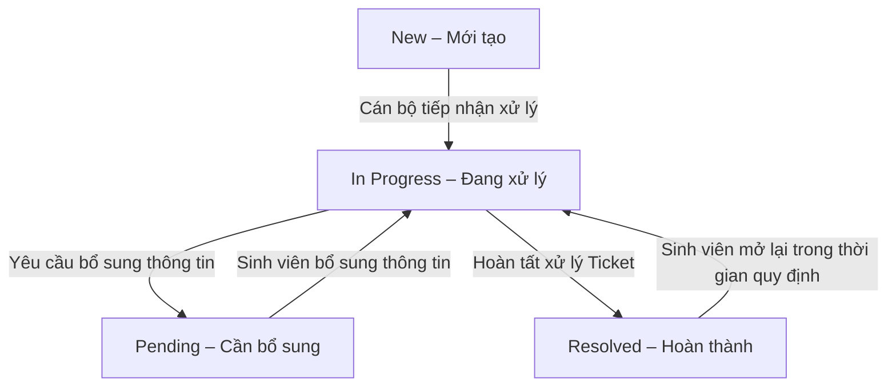

# Ticket State Transition – UniSupport

## 1. Tổng quan (Overview)

Tài liệu mô tả các trạng thái và quy tắc chuyển đổi trạng thái của Ticket trong hệ thống UniSupport.

Mục tiêu:

- Chuẩn hóa quá trình theo dõi và xử lý Ticket.
- Xác định các trạng thái trong vòng đời Ticket.
- Làm rõ các hành động dẫn đến việc chuyển đổi trạng thái.
- Xác định vai trò được phép thực hiện chuyển đổi.
- Đảm bảo lịch sử xử lý Ticket được ghi nhận và theo dõi.

## 2. Danh sách trạng thái (Ticket States)

Hệ thống UniSupport sử dụng 04 trạng thái Ticket chính:

| Trạng thái | Mã trạng thái | Mô tả |
|---|---|---|
| Mới tạo | `New` | Ticket được tạo thành công và đang chờ tiếp nhận hoặc xử lý. |
| Đang xử lý | `In Progress` | Ticket đang được cán bộ tiếp nhận và xử lý. |
| Cần bổ sung | `Pending` | Ticket đang chờ sinh viên cung cấp thêm thông tin hoặc tài liệu. |
| Hoàn thành | `Resolved` | Ticket đã được cán bộ xử lý hoàn tất và có kết quả giải quyết. |

Các trạng thái được sử dụng để sinh viên theo dõi tiến độ và cán bộ quản lý quá trình xử lý yêu cầu.

## 3. Sơ đồ chuyển đổi trạng thái (State Transition Diagram)

## 4. Các chuyển đổi trạng thái hợp lệ (Valid Transitions)

| Trạng thái hiện tại | Hành động | Trạng thái tiếp theo | Vai trò thực hiện |
|---|---|---|---|
| New | Tiếp nhận xử lý Ticket | In Progress | Staff |
| In Progress | Yêu cầu sinh viên bổ sung thông tin | Pending | Staff |
| Pending | Sinh viên bổ sung thông tin theo yêu cầu | In Progress | Student |
| In Progress | Hoàn tất xử lý và cập nhật kết quả | Resolved | Staff |
| Resolved | Mở lại Ticket trong thời gian quy định | In Progress | Student |

## 5. Quy tắc chuyển đổi trạng thái (Transition Rules)

### ST-01 – Khởi tạo Ticket

- Ticket được gán trạng thái `New` khi sinh viên tạo yêu cầu thành công.
- Hệ thống tự động cấp mã Ticket duy nhất.
- Ticket được đưa vào danh sách tiếp nhận và xử lý theo quy trình phân luồng.
- Sinh viên có thể theo dõi trạng thái Ticket sau khi tạo.

### ST-02 – Tiếp nhận Ticket

- Cán bộ có quyền xử lý thực hiện tiếp nhận Ticket.
- Ticket chuyển từ `New` sang `In Progress`.
- Hệ thống ghi nhận cán bộ tiếp nhận và thời điểm thay đổi trạng thái.

### ST-03 – Yêu cầu bổ sung thông tin

- Trong quá trình xử lý, cán bộ có thể yêu cầu sinh viên bổ sung thông tin hoặc tài liệu.
- Ticket chuyển từ `In Progress` sang `Pending`.
- Nội dung cần bổ sung được gửi đến sinh viên.
- Sinh viên được thông báo về yêu cầu bổ sung thông tin.

### ST-04 – Tiếp tục xử lý Ticket

- Sinh viên cung cấp thông tin hoặc tài liệu bổ sung theo yêu cầu.
- Ticket chuyển từ `Pending` sang `In Progress`.
- Cán bộ tiếp tục xử lý yêu cầu dựa trên thông tin được bổ sung.
- Hệ thống ghi nhận nội dung và thời điểm bổ sung.

### ST-05 – Hoàn thành Ticket

- Cán bộ hoàn tất việc xử lý yêu cầu.
- Cán bộ cập nhật kết quả xử lý Ticket.
- Ticket chuyển từ `In Progress` sang `Resolved`.
- Sinh viên nhận được thông báo về kết quả xử lý.
- Lịch sử xử lý Ticket được cập nhật.

### ST-06 – Mở lại Ticket

- Sinh viên được phép mở lại Ticket ở trạng thái `Resolved` trong thời gian quy định.
- Khi được mở lại, Ticket chuyển sang `In Progress`.
- Cán bộ tiếp tục xử lý yêu cầu.
- Hệ thống ghi nhận sự kiện mở lại trong lịch sử Ticket.

Thời hạn cụ thể cho phép mở lại Ticket cần được xác định trong quy tắc nghiệp vụ.

## 6. Ràng buộc chuyển đổi trạng thái (State Constraints)

### 6.1. Quyền cập nhật trạng thái

- **Student:** Tạo Ticket, bổ sung thông tin và mở lại Ticket trong thời gian quy định.
- **Staff:** Tiếp nhận, cập nhật trạng thái, yêu cầu bổ sung và hoàn thành Ticket theo quyền được cấp.
- **Manager:** Giám sát tiến độ, điều chuyển hoặc phân công lại Ticket trong phạm vi quản lý.
- **Administrator:** Quản lý tài khoản, vai trò và cấu hình hệ thống theo quyền quản trị.

### 6.2. Điều kiện thay đổi trạng thái

- Ticket chỉ được chuyển đổi giữa các trạng thái hợp lệ.
- Việc thay đổi trạng thái phải tuân thủ quyền truy cập của người thực hiện.
- Khi yêu cầu bổ sung thông tin, cán bộ cần nêu rõ nội dung cần bổ sung.
- Khi hoàn thành Ticket, cán bộ cần cập nhật kết quả xử lý.
- Sinh viên chỉ được mở lại Ticket trong thời gian được hệ thống cho phép.

### 6.3. Lịch sử thay đổi trạng thái

Hệ thống ghi nhận các thông tin liên quan đến thay đổi trạng thái, bao gồm:

- Ticket được cập nhật.
- Trạng thái trước và sau khi thay đổi.
- Người thực hiện thao tác.
- Thời điểm cập nhật.
- Nội dung xử lý hoặc bổ sung liên quan.

Lịch sử xử lý được sử dụng để theo dõi quá trình giải quyết yêu cầu.

## 7. Các trường hợp không hợp lệ (Invalid Transitions)

Các chuyển đổi không thuộc quy trình đã xác định không được thực hiện trực tiếp.

Ví dụ:

| Chuyển đổi | Lý do |
|---|---|
| New → Resolved | Ticket chưa trải qua bước tiếp nhận và xử lý. |
| New → Pending | Ticket chưa được cán bộ tiếp nhận để yêu cầu bổ sung. |
| Pending → Resolved | Ticket đang chờ sinh viên bổ sung thông tin. |
| Resolved → Pending | Ticket đã hoàn thành, cần được mở lại trước khi tiếp tục xử lý. |

## 8. Tài liệu liên quan (Related Documents)

- `business-rules.md` – Các quy tắc nghiệp vụ chung.
- `../01-product/actors-and-roles.md` – Vai trò và quyền hạn người dùng.
- `../01-product/product-scope.md` – Phạm vi sản phẩm.
- `../03-modules/` – Yêu cầu chức năng của từng module.