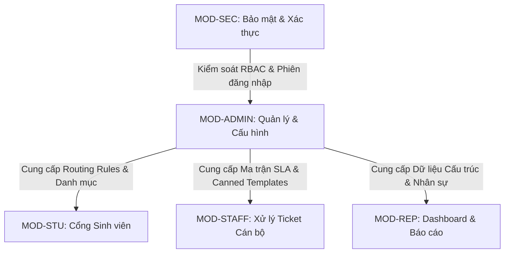

# PRD – MODULE C: PHÂN HỆ QUẢN LÝ HOẠT ĐỘNG & CẤU HÌNH HỆ THỐNG (QUẢN LÝ & QUẢN TRỊ VIÊN)

> **Dự án:** UniSupport – Hệ thống Quản lý Yêu cầu Hỗ trợ Sinh viên  
> **Khách hàng:** Aurora University  
> **Mã phân hệ:** MOD-ADMIN (Module C - Operations & Administration)  
> **Phiên bản:** v1.0 | Ngày cập nhật: 03/10/2026  
> **Tài liệu cha:** [UNISUPPORT_PRD.md](file:///c:/Users/Admin/Documents/New%20Folder/UniSupport_Project/docs/prd/UNISUPPORT_PRD.md)  
> **Giai đoạn triển khai chính:** Phase P5 (Tuần 13–15)

---

## 1. Tổng quan phân hệ

### 1.1. Mục tiêu
Cung cấp trung tâm điều hành và thiết lập toàn diện cho **Quản lý phòng ban (Manager)** và **Quản trị viên hệ thống (Administrator)** của Aurora University. Phân hệ này chịu trách nhiệm:
1. Giám sát tải công việc (Workload) theo thời gian thực và phân công lại nhân sự để tránh tình trạng quá tải hoặc tồn đọng ticket.
2. Quản trị danh mục dịch vụ, phòng ban tiếp nhận và các quy tắc phân luồng tự động (Auto-routing).
3. Thiết lập ma trận thời hạn cam kết dịch vụ (SLA) và hệ thống cảnh báo quá hạn.
4. Quản lý người dùng, phân quyền truy cập 4 vai trò (RBAC), chuẩn hóa kho mẫu phản hồi (Canned Responses) và xuất bản nội dung hỏi đáp (FAQ).

### 1.2. Đối tượng sử dụng chính (Target Actors)
* **Quản lý phòng ban (Manager):** Trưởng/Phó phòng ban chuyên môn (*Đào tạo*, *Công tác sinh viên*, *Kế hoạch - Tài chính*, *Khảo thí & ĐBCL*). Có quyền quản lý cán bộ thuộc phòng, điều chuyển Ticket, thiết lập mẫu trả lời riêng của phòng và duyệt nội dung nghiệp vụ.
* **Quản trị viên hệ thống (Administrator):** Quản lý toàn bộ cấu hình lõi, danh mục, phòng ban, phân quyền tài khoản người dùng và quy tắc định tuyến tự động trên toàn trường.

---

## 2. User Persona & Use Case chính

### 2.1. Persona 1 – Quản lý phòng ban (Trưởng phòng Đào tạo / CTSV)
* **Vai trò:** Điều phối hoạt động và giám sát chất lượng giải quyết yêu cầu của phòng ban.
* **Mục tiêu:** Nắm bắt số lượng ticket đang giải quyết, kịp thời tái phân công khi cán bộ bị ốm/nghỉ phép hoặc khối lượng việc dồn ứ, đảm bảo tỷ lệ hoàn thành đúng hạn SLA đạt trên 90%.
* **Nhu cầu chính:** Màn hình Workload trực quan, thao tác chuyển việc hàng loạt (Bulk Reassignment), thiết lập kho câu trả lời mẫu chuẩn mực.

### 2.2. Persona 2 – Quản trị viên hệ thống (IT Administrator)
* **Vai trò:** Quản trị kỹ thuật, phân quyền và duy trì sự ổn định của hệ thống.
* **Mục tiêu:** Cấp phát tài khoản nhanh chóng, gán đúng vai trò và phòng ban, tạo mới các danh mục yêu cầu khi trường có quy trình mới mà không cần can thiệp vào mã nguồn (Zero-code configuration).
* **Nhu cầu chính:** Giao diện RBAC bảo mật, quản lý danh mục và phòng ban an toàn (chặn xóa dữ liệu có ràng buộc lịch sử), kiểm soát chặt chẽ quy tắc Routing Rule.

### 2.3. Use Case tiêu biểu: Quản lý điều chuyển Ticket và Admin cấu hình Routing Rule
1. **Trường hợp 1 (Điều chuyển việc):** Quản lý mở màn hình Workload $\rightarrow$ phát hiện Cán bộ A đang giữ 25 ticket và có 3 ticket sắp chạm ngưỡng cảnh báo SLA đỏ $\rightarrow$ Quản lý tích chọn 10 ticket của Cán bộ A $\rightarrow$ chọn Cán bộ B $\rightarrow$ bấm "Tái phân công" $\rightarrow$ Hệ thống cập nhật người xử lý mới, gửi thông báo cho Cán bộ B và ghi log kiểm toán.
2. **Trường hợp 2 (Cấu hình luồng tự động):** Admin tạo Danh mục mới "Hỗ trợ học phí kỳ hè" $\rightarrow$ gán Phòng ban tiếp nhận là "Phòng Kế hoạch - Tài chính" $\rightarrow$ cấu hình Rule: `IF Danh mục == 'Hỗ trợ học phí kỳ hè' THEN Phân về Phòng Kế hoạch - Tài chính, Priority = 'Cao'` $\rightarrow$ Kích hoạt rule $\rightarrow$ Toàn bộ yêu cầu sinh viên gửi vào danh mục này tự động về hàng đợi tài chính với SLA 12 giờ làm việc.

---

## 3. Đặc tả chi tiết các yêu cầu chức năng (Functional Specifications)

#### FR-23: Theo dõi khối lượng công việc & hoạt động phòng ban (Workload Monitoring)

* **User Story:** Là một Quản lý phòng ban, tôi muốn theo dõi khối lượng Ticket đang phân công cho từng cán bộ để nắm bắt tình hình phân bổ nhân lực và tránh quá tải.
* **Đặc tả logic (Specifications):**
  * Màn hình Workload hiển thị danh sách cán bộ trong phòng ban kèm các chỉ số:
    * Số Ticket đang xử lý (`In Progress`).
    * Số Ticket mới chưa xử lý.
    * Số Ticket sắp/đã quá hạn SLA (badge cảnh báo màu vàng/đỏ).
    * Tổng số Ticket đã hoàn thành trong tháng.
  * Hỗ trợ thanh lọc dữ liệu theo khoảng thời gian tùy chọn (Hôm nay, 7 ngày, 30 ngày, hoặc chọn khoảng ngày).
* **Tiêu chí chấp nhận (Acceptance Criteria):**
  * **AC-23.1 (Thống kê chính xác):** Các chỉ số số lượng Ticket trên bảng Workload phản ánh chính xác dữ liệu thực tế tại thời điểm xem.
  * **AC-23.2 (Phân quyền phạm vi phòng ban):** Quản lý chỉ xem được bảng Workload của nhân sự trực thuộc phòng ban mình phụ trách; không xem được nhân sự phòng ban khác.

#### FR-24: Điều chuyển và tái phân công Ticket (Ticket Reassignment)

* **User Story:** Là một Quản lý phòng ban, tôi muốn chủ động điều chuyển Ticket từ cán bộ đang quá tải sang cán bộ khác để đảm bảo tiến độ xử lý cam kết.
* **Đặc tả logic (Specifications):**
  * Quản lý có quyền chọn 1 Ticket hoặc tích chọn nhiều Ticket cùng lúc (Bulk Action).
  * Bấm nút "Phân công lại" $\rightarrow$ chọn cán bộ tiếp nhận mới từ danh sách nhân sự phòng ban $\rightarrow$ xác nhận.
  * Hệ thống cập nhật người phụ trách mới ngay lập tức và gửi thông báo In-app/Email cho cán bộ được bàn giao.
* **Tiêu chí chấp nhận (Acceptance Criteria):**
  * **AC-24.1 (Phân công lại hàng loạt):** Quản lý chọn 5 Ticket và chuyển cho cán bộ B $\rightarrow$ cả 5 Ticket lập tức cập nhật Assignee thành cán bộ B và ghi nhận nhật ký người thực hiện là Quản lý.
  * **AC-24.2 (Gửi thông báo bàn giao):** Cán bộ nhận bàn giao nhận được thông báo tức thời kèm danh sách mã Ticket mới được giao.

#### FR-25: Thiết lập thời hạn xử lý & Cảnh báo SLA (SLA & Deadline Alerts)

* **User Story:** Là một Quản lý hoặc Quản trị viên, tôi muốn cấu hình thời hạn xử lý chuẩn (SLA) theo mức ưu tiên và danh mục, đồng thời nhận cảnh báo sớm để giảm thiểu Ticket quá hạn.
* **Đặc tả logic (Specifications):**
  * Cấu hình thời hạn giải quyết tiêu chuẩn theo mức ưu tiên:
    * *Khẩn cấp (Urgent):* Mặc định **04 giờ làm việc**.
    * *Cao (High):* Mặc định **12 giờ làm việc**.
    * *Trung bình (Medium):* Mặc định **24 giờ làm việc**.
    * *Thấp (Low):* Mặc định **48 giờ làm việc**.
  * Quy tắc cảnh báo tự động:
    * Cảnh báo vàng: Khi thời gian còn lại $\le 25\%$ tổng thời hạn.
    * Cảnh báo đỏ: Khi thời gian đã vượt quá thời hạn quy định (Overdue).
* **Tiêu chí chấp nhận (Acceptance Criteria):**
  * **AC-25.1 (Tính deadline chính xác):** Khi Ticket được tạo hoặc đổi mức ưu tiên, hệ thống tính toán chính xác thời điểm Deadline hiển thị trên Ticket.
  * **AC-25.2 (Bắn cảnh báo tự động):** Khi Ticket chạm ngưỡng cảnh báo vàng hoặc đỏ, hệ thống tự động đổi màu badge hiển thị và gửi thông báo cho Cán bộ thụ lý cùng Quản lý phòng ban.

#### FR-26: Quản lý danh mục yêu cầu (Category Management)

* **User Story:** Là một Quản trị viên, tôi muốn tạo mới, chỉnh sửa và quản lý danh sách các danh mục yêu cầu hỗ trợ để phù hợp với quy trình hoạt động của trường.
* **Đặc tả logic (Specifications):**
  * Mỗi danh mục bao gồm: Tên danh mục, Mô tả hướng dẫn, Phòng ban tiếp nhận mặc định, Trạng thái hoạt động (Kích hoạt / Tạm ngừng).
  * **Ràng buộc an toàn dữ liệu:** Không cho phép xóa cứng danh mục đã có phát sinh Ticket trong quá khứ (chỉ cho phép chuyển trạng thái sang Tạm ngừng / Inactive).
* **Tiêu chí chấp nhận (Acceptance Criteria):**
  * **AC-26.1 (Tạo và sửa danh mục):** Thêm mới danh mục thành công; danh mục được kích hoạt lập tức xuất hiện trong dropdown chọn danh mục của sinh viên.
  * **AC-26.2 (Bảo vệ dữ liệu lịch sử):** Nhấn xóa danh mục đã có dữ liệu $\rightarrow$ hệ thống chặn xóa và gợi ý chuyển sang trạng thái "Tạm ngừng hoạt động".

#### FR-27: Quản lý cơ cấu phòng ban (Department Management)

* **User Story:** Là một Quản trị viên, tôi muốn quản lý danh sách phòng ban hỗ trợ và gán cán bộ vào đúng phòng ban để đảm bảo tính phân luồng chính xác.
* **Đặc tả logic (Specifications):**
  * Thông tin phòng ban: Mã phòng ban, Tên phòng ban, Email liên hệ, Cán bộ quản lý phụ trách (Trưởng phòng), Danh sách nhân sự trực thuộc.
  * Cho phép thêm mới phòng ban, cập nhật thông tin và điều chuyển cán bộ giữa các phòng ban.
* **Tiêu chí chấp nhận (Acceptance Criteria):**
  * **AC-27.1 (Thêm/Sửa phòng ban):** Tạo mới phòng ban thành công; danh sách phòng ban hiển thị đầy đủ trong các chức năng phân luồng và báo cáo.
  * **AC-27.2 (Ràng buộc nhân sự):** Mỗi phòng ban bắt buộc phải có ít nhất 01 Quản lý phụ trách và không cho phép xóa phòng ban khi vẫn còn nhân sự hoặc Ticket đang mở.

#### FR-28: Quản lý mức độ ưu tiên (Priority Matrix Configuration)

* **User Story:** Là một Quản trị viên, tôi muốn quản lý các mức độ ưu tiên và thời gian xử lý mục tiêu để chuẩn hóa thời gian phản hồi toàn trường.
* **Đặc tả logic (Specifications):**
  * Quản lý 04 mức ưu tiên: Thấp (Low), Trung bình (Medium), Cao (High), Khẩn cấp (Urgent).
  * Cấu hình mã màu đại diện (Xanh lá, Xanh dương, Cam, Đỏ) và số giờ SLA tiêu chuẩn cho từng mức.
* **Tiêu chí chấp nhận (Acceptance Criteria):**
  * **AC-28.1 (Cập nhật thời gian SLA):** Khi cập nhật số giờ SLA của mức "Cao", các Ticket mới được tạo ở mức "Cao" sẽ áp dụng theo số giờ mới này.
  * **AC-28.2 (Bảo toàn lịch sử ticket cũ):** Việc cập nhật SLA cấu hình không làm thay đổi hạn chót (Deadline) của các Ticket đã hoàn thành trong quá khứ.

#### FR-29: Cấu hình quy tắc phân luồng tự động (Routing Rules Configuration)

* **User Story:** Là một Quản trị viên, tôi muốn thiết lập quy tắc tự động phân luồng để hệ thống tự chuyển Ticket đến đúng phòng ban hoặc cán bộ cụ thể mà không cần can thiệp thủ công.
* **Đặc tả logic (Specifications):**
  * Cấu trúc quy tắc dạng logic: `IF [Danh mục == X] THEN [Chuyển về Phòng ban Y] AND [Gán cho Cán bộ Z (tùy chọn)]`.
  * Hỗ trợ thiết lập thứ tự ưu tiên áp dụng giữa các quy tắc (Rule Execution Order).
  * Hỗ trợ bật/tắt từng quy tắc độc lập.
* **Tiêu chí chấp nhận (Acceptance Criteria):**
  * **AC-29.1 (Áp dụng đúng quy tắc):** Tạo Ticket thuộc danh mục được cấu hình rule $\rightarrow$ Ticket tự động phân về đúng phòng ban và cán bộ quy định mà không cần thao tác phân loại thủ công.
  * **AC-29.2 (Quy tắc mặc định khi không khớp):** Nếu Ticket không khớp với bất kỳ quy tắc đặc thù nào, hệ thống gán vào phòng ban mặc định của danh mục và đưa vào hàng đợi `Chưa phân công`.

#### FR-30: Quản lý người dùng và phân quyền vai trò (User & Role RBAC Management)

* **User Story:** Là một Quản trị viên, tôi muốn quản lý tài khoản người dùng và cấp phát vai trò để kiểm soát quyền hạn chặt chẽ trên toàn hệ thống.
* **Đặc tả logic (Specifications):**
  * 04 vai trò cố định: `Sinh viên`, `Cán bộ`, `Quản lý`, `Quản trị viên`.
  * Các chức năng quản trị: Tạo tài khoản cán bộ mới, Cập nhật thông tin, Khóa/Mở khóa tài khoản, Đặt lại mật khẩu mặc định.
  * Phân bổ phòng ban: Mỗi cán bộ/quản lý phải được gán vào ít nhất một phòng ban cụ thể.
  * Không cho phép tự khóa hoặc tự xóa tài khoản Quản trị viên đang đăng nhập.
* **Tiêu chí chấp nhận (Acceptance Criteria):**
  * **AC-30.1 (Phân quyền có hiệu lực ngay):** Cập nhật vai trò của một tài khoản từ "Cán bộ" lên "Quản lý" $\rightarrow$ tài khoản đó có ngay quyền xem Workload và điều chuyển Ticket tại phiên làm việc tiếp theo.
  * **AC-30.2 (Khóa tài khoản):** Khi tài khoản bị khóa, người dùng đó lập tức bị đăng xuất và không thể đăng nhập lại vào hệ thống.

#### FR-31: Quản trị nội dung FAQ & Hướng dẫn (FAQ Management)

* **User Story:** Là một Quản lý hoặc Quản trị viên, tôi muốn tạo và xuất bản các bài viết hướng dẫn giải đáp thắc mắc để sinh viên tự tìm hiểu thông tin.
* **Đặc tả logic (Specifications):**
  * Trình soạn thảo văn bản hỗ trợ định dạng rich text (in đậm, nghiêng, danh sách số, bullet, chèn liên kết).
  * Thông tin bài viết: Tiêu đề bài viết, Chuyên mục, Nội dung chi tiết, Từ khóa tìm kiếm (Tags), Trạng thái (Bản nháp / Xuất bản).
  * Hỗ trợ sắp xếp thứ tự hiển thị ưu tiên của các bài viết nổi bật.
* **Tiêu chí chấp nhận (Acceptance Criteria):**
  * **AC-31.1 (Xuất bản FAQ):** Bài viết sau khi nhấn "Xuất bản" sẽ lập tức hiển thị công khai trên cổng tra cứu FAQ của sinh viên.
  * **AC-31.2 (Chế độ bản nháp):** Bài viết ở trạng thái "Bản nháp" chỉ hiển thị với Quản lý và Admin; sinh viên hoàn toàn không thể tìm kiếm hoặc nhìn thấy.

#### FR-32: Quản lý mẫu phản hồi chuẩn (Response Template Management)

* **User Story:** Là một Quản lý phòng ban, tôi muốn tạo và chuẩn hóa các mẫu câu trả lời của phòng ban để nâng cao chất lượng và tính chuyên nghiệp trong giao tiếp với sinh viên.
* **Đặc tả logic (Specifications):**
  * Quản lý mẫu câu trả lời theo phạm vi: Mẫu dùng chung toàn trường (do Admin tạo) hoặc Mẫu riêng của phòng ban (do Quản lý phòng ban tạo).
  * Hỗ trợ chèn các trường dữ liệu động (Placeholder): `{ten_sinh_vien}`, `{ma_ticket}`, `{ten_can_bo}`.
* **Tiêu chí chấp nhận (Acceptance Criteria):**
  * **AC-32.1 (Phân quyền mẫu trả lời):** Cán bộ phòng Đào tạo chỉ nhìn thấy mẫu dùng chung toàn trường và mẫu riêng của phòng Đào tạo; không thấy mẫu của phòng Kế toán.
  * **AC-32.2 (Thay thế placeholder chính xác):** Khi cán bộ chọn mẫu, các biến `{ten_sinh_vien}`, `{ma_ticket}` được thay thế bằng dữ liệu thực của Ticket tương ứng.

---

## 4. Yêu cầu phi chức năng phân hệ (Module NFR)

* **Bảo mật phân quyền (RBAC Security):**
  * Toàn bộ các API quản trị (`/api/admin/*`, `/api/manager/*`) bắt buộc phải kiểm tra Token và xác thực Role tại Middleware tầng Backend. Trả về `403 Forbidden` ngay lập tức nếu người dùng không đủ thẩm quyền.
* **Tính toàn vẹn dữ liệu (Data Integrity):**
  * Không cho phép xóa vật lý (Hard delete) bất kỳ Danh mục, Phòng ban hoặc Tài khoản nào đã có liên kết với dữ liệu Ticket trong cơ sở dữ liệu. Tất cả đều áp dụng cơ chế Soft Delete hoặc chuyển trạng thái sang `Inactive`.
* **Hiệu năng & Tốc độ phản hồi:**
  * Thao tác cấu hình (Thêm/Sửa Routing Rule, Category, User) phản hồi $\le 500$ms.
  * Tải bảng dữ liệu Workload toàn phòng ban $\le 1.0$ giây.
* **Nhật ký kiểm toán (Audit Trail):**
  * 100% các hành động thêm, sửa, xóa, khóa/mở khóa tài khoản hoặc thay đổi quy tắc phân luồng đều tự động ghi vào `System Audit Log` kèm IP, Timestamp và thông tin chi tiết trước/sau thay đổi.

---

## 5. Mối liên hệ & Tích hợp với các phân hệ khác

* **Với Module A (Sinh viên):** Cấu hình danh mục và FAQ từ Module C quyết định những dịch vụ sinh viên được chọn và bài viết hướng dẫn sinh viên tra cứu.
* **Với Module B (Cán bộ):** Cấu hình SLA, ma trận độ ưu tiên, quy tắc phân luồng và mẫu câu trả lời trực tiếp điều phối luồng làm việc của cán bộ.
* **Với Module D (Báo cáo):** Cung cấp cấu trúc phòng ban và chỉ tiêu SLA làm căn cứ tính toán tỷ lệ đúng hạn và báo cáo hiệu suất.
* **Với Module E (Bảo mật):** Thừa hưởng cơ chế xác thực JWT, RBAC và ghi nhật ký kiểm toán hệ thống.
