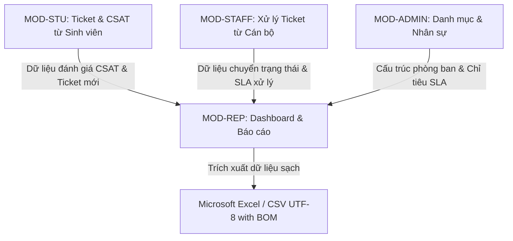

# PRD – MODULE D: PHÂN HỆ DASHBOARD & BÁO CÁO PHÂN TÍCH (ANALYTICS & REPORTING)

> **Dự án:** UniSupport – Hệ thống Quản lý Yêu cầu Hỗ trợ Sinh viên  
> **Khách hàng:** Aurora University  
> **Mã phân hệ:** MOD-REP (Module D - Analytics & Reporting)  
> **Phiên bản:** v1.0 | Ngày cập nhật: 03/10/2026  
> **Tài liệu cha:** [UNISUPPORT_PRD.md](file:///c:/Users/Admin/Documents/New%20Folder/UniSupport_Project/docs/prd/UNISUPPORT_PRD.md)  
> **Giai đoạn triển khai chính:** Phase 6 (Tuần 16–18) 

---

## 1. Tổng quan phân hệ

### 1.1. Mục tiêu
Cung cấp trung tâm phân tích dữ liệu và báo cáo thông minh cho Ban Giám hiệu, Quản lý các phòng ban và Quản trị viên của Aurora University. Phân hệ này giúp:
1. Trực quan hóa số liệu tiếp nhận và xử lý yêu cầu theo thời gian thực (Real-time status).
2. Đo lường các chỉ số vận hành cốt lõi: Tỷ lệ hoàn thành, lượng tồn đọng (Backlog), thời gian giải quyết trung bình (MTTR) và tỷ lệ tuân thủ cam kết dịch vụ (SLA compliance).
3. Đánh giá minh bạch hiệu suất công việc của từng cán bộ và từng phòng ban chuyên môn.
4. Nhận diện các vấn đề học đường phát sinh nhiều nhất (Top Issues) và phân tích xu hướng biến động theo thời gian để chủ động điều phối nguồn lực.
5. Đo lường chỉ số hài lòng của người học (CSAT) và xuất báo cáo dữ liệu sạch định dạng CSV chuẩn UTF-8 có BOM.

### 1.2. Đối tượng sử dụng chính (Target Actors)
* **Quản trị viên (Admin) & Lãnh đạo trường:** Xem toàn cảnh dữ liệu trên quy mô toàn trường (Cross-department view), so sánh hiệu quả giữa các phòng ban.
* **Quản lý phòng ban (Manager):** Giám sát chi tiết các chỉ số nội bộ của phòng ban mình phụ trách, theo dõi tiến độ xử lý và bảng xếp hạng hiệu suất của các cán bộ trực thuộc.

---

## 2. User Persona & Use Case chính

### 2.1. Persona 1 – Trưởng phòng Quản lý Hỗ trợ Sinh viên
* **Vai trò:** Theo dõi hiệu quả dịch vụ sinh viên, lập báo cáo định kỳ cho Ban Giám hiệu.
* **Mục tiêu:** Nhanh chóng nắm được tỷ lệ hài lòng (CSAT), số lượng ticket quá hạn và nhóm vấn đề sinh viên hay thắc mắc nhất trong từng giai đoạn (đầu kỳ, thi cử, tốt nghiệp).
* **Nhu cầu chính:** Biểu đồ xu hướng trực quan, bảng xếp hạng CSAT, tính năng tải báo cáo CSV mở trực tiếp trên Excel không bị lỗi font Tiếng Việt.

### 2.2. Persona 2 – Quản trị viên hệ thống (Data/System Admin)
* **Vai trò:** Kiểm tra tính toàn vẹn dữ liệu, trích xuất dữ liệu tổng hợp phục vụ lưu trữ hoặc phân tích chuyên sâu.
* **Mục tiêu:** Cung cấp số liệu chính xác, truy vấn nhanh không gây nghẽn cơ sở dữ liệu khi hệ thống có hàng chục nghìn bản ghi.

### 2.3. Use Case tiêu biểu: Quản lý phân tích xu hướng và trích xuất báo cáo CSV
1. **Bước 1:** Quản lý đăng nhập vào hệ thống UniSupport, truy cập menu "Báo cáo & Thống kê".
2. **Bước 2:** Chọn phạm vi: "Phòng Công tác sinh viên", khoảng thời gian: "Học kỳ 1 (01/09/2026 - 31/12/2026)".
3. **Bước 3:** Hệ thống tính toán và hiển thị các Metric Cards (Tổng tiếp nhận: 1.250, Tỷ lệ hoàn thành: 94.2%, CSAT: 4.6/5.0).
4. **Bước 4:** Quản lý xem biểu đồ cột ngang "Top 5 nhóm vấn đề" $\rightarrow$ phát hiện vấn đề "Xác nhận vay vốn sinh viên" chiếm 42% tổng lượng ticket.
5. **Bước 5:** Quản lý chuyển sang tab "Báo cáo hiệu suất cán bộ" để xem tỷ lệ giải quyết đúng hạn SLA của từng nhân sự.
6. **Bước 6:** Bấm nút "Xuất CSV", chọn "Báo cáo CSAT chi tiết" $\rightarrow$ trình duyệt tải về file `.csv` mã hóa UTF-8 with BOM sẵn sàng mở trên Microsoft Excel.

---

## 3. Đặc tả chi tiết các yêu cầu chức năng (Functional Specifications)

#### FR-33: Dashboard thống kê trạng thái thời gian thực (Real-time Status Dashboard)

* **User Story:** Là một Quản lý hoặc Quản trị viên, tôi muốn xem biểu đồ tổng quan số lượng Ticket theo trạng thái để nắm bắt nhanh tình hình vận hành của nhà trường.
* **Đặc tả logic (Specifications):**
  * Các thẻ chỉ số (Metric Cards):
    * Tổng số Ticket tiếp nhận.
    * Số Ticket `Mới tạo` (chưa phân luồng).
    * Số Ticket `Đang xử lý`.
    * Số Ticket `Cần bổ sung` (chờ phản hồi của sinh viên).
    * Số Ticket `Hoàn thành`.
  * Biểu đồ tròn (Donut/Pie Chart) thể hiện cơ cấu tỷ lệ % theo từng trạng thái.
  * Bộ lọc linh hoạt: Theo toàn trường hoặc theo từng phòng ban; Theo mốc thời gian: *Hôm nay*, *7 ngày qua*, *30 ngày qua*, hoặc *Khoảng ngày tùy chọn*.
* **Tiêu chí chấp nhận (Acceptance Criteria):**
  * **AC-33.1 (Cập nhật số liệu thời gian thực):** Dữ liệu thống kê trên Dashboard cập nhật ngay khi có Ticket mới phát sinh hoặc có Ticket chuyển trạng thái.
  * **AC-33.2 (Lọc theo phòng ban):** Quản lý chọn xem phòng Đào tạo $\rightarrow$ toàn bộ số liệu và biểu đồ tự động chuyển đổi hiển thị riêng cho phòng Đào tạo.

#### FR-34: Theo dõi tỷ lệ hoàn thành & Ticket tồn đọng (Completion Rate & Backlog Tracking)

* **User Story:** Là một Quản lý, tôi muốn theo dõi tỷ lệ hoàn thành yêu cầu và lượng Ticket còn tồn đọng qua các ngày để đánh giá khả năng đáp ứng công việc của đội ngũ.
* **Đặc tả logic (Specifications):**
  * Tỷ lệ hoàn thành tính theo công thức:
    $$\text{Completion Rate} = \left(\frac{\text{Số Ticket Hoàn thành}}{\text{Tổng Ticket tiếp nhận trong kỳ}}\right) \times 100\%$$
  * Chỉ số Backlog: Tổng số Ticket đang ở trạng thái chưa hoàn thành (`Mới tạo`, `Đang xử lý`, `Cần bổ sung`) tồn qua các ngày.
  * Danh sách cảnh báo "Top Ticket tồn đọng lâu nhất": Hiển thị 5 Ticket có tuổi đời lớn nhất chưa được xử lý xong kèm số ngày tồn đọng.
* **Tiêu chí chấp nhận (Acceptance Criteria):**
  * **AC-34.1 (Hiển thị tỷ lệ và so sánh):** Dashboard thể hiện tỷ lệ % hoàn thành kèm mũi tên chỉ số tăng/giảm so với chu kỳ trước đó.
  * **AC-34.2 (Cảnh báo Backlog vượt ngưỡng):** Nếu số lượng Ticket tồn đọng tăng quá 20% so với tuần trước, hệ thống hiển thị biểu tượng cảnh báo màu cam trên thẻ Backlog.

#### FR-35: Theo dõi thời gian xử lý trung bình (MTTR Analytics)

* **User Story:** Là một Quản lý, tôi muốn biết thời gian trung bình để xử lý xong một Ticket theo từng phòng ban và mức ưu tiên để tìm ra các khâu còn chậm trễ.
* **Đặc tả logic (Specifications):**
  * Chỉ số MTTR (Mean Time To Resolve): Tính từ thời điểm sinh viên tạo Ticket đến thời điểm Ticket chuyển sang `Hoàn thành` lần đầu tiên.
  * Phân rã thời gian xử lý theo từng phòng ban và theo từng mức độ ưu tiên (đơn vị: Giờ).
  * Công thức tính MTTR:
    $$\text{MTTR} = \frac{\sum (\text{Thời điểm Hoàn thành} - \text{Thời điểm Tạo})}{\text{Tổng số Ticket đã hoàn thành}}$$
* **Tiêu chí chấp nhận (Acceptance Criteria):**
  * **AC-35.1 (Báo cáo MTTR chi tiết):** Hiển thị bảng so sánh thời gian xử lý trung bình giữa các phòng ban, làm nổi bật phòng ban có thời gian xử lý nhanh nhất và chậm nhất.
  * **AC-35.2 (Phân loại theo Priority):** Hiển thị rõ MTTR của nhóm `Khẩn cấp` (ví dụ: trung bình 3.2 giờ) so với nhóm `Thấp` (trung bình 36 giờ).

#### FR-36: Thống kê hiệu suất theo phòng ban và cán bộ (Staff Performance Tracking)

* **User Story:** Là một Quản lý hoặc Quản trị viên, tôi muốn xem bảng tổng hợp hiệu suất của từng cán bộ để đánh giá chất lượng và khối lượng công việc hoàn thành.
* **Đặc tả logic (Specifications):**
  * Bảng danh sách cán bộ với các cột chỉ số:
    * Họ tên & Mã cán bộ.
    * Phòng ban trực thuộc.
    * Số Ticket được phân công thụ lý.
    * Số Ticket đã giải quyết hoàn tất.
    * Tỷ lệ giải quyết đúng hạn SLA (%).
    * Điểm đánh giá hài lòng trung bình (CSAT Score / 5 sao).
  * Hỗ trợ nhấp chuột vào từng tiêu đề cột để sắp xếp thứ hạng từ cao xuống thấp hoặc ngược lại.
* **Tiêu chí chấp nhận (Acceptance Criteria):**
  * **AC-36.1 (Bảng hiệu suất minh bạch):** Quản lý xem được đầy đủ số liệu của các nhân sự trực thuộc phòng ban mình, hỗ trợ sắp xếp theo tỷ lệ đúng hạn SLA để đánh giá thi đua.
  * **AC-36.2 (Tìm kiếm cán bộ nhanh):** Cung cấp ô tìm kiếm theo tên cán bộ để tra cứu nhanh chỉ số cá nhân.

#### FR-37: Thống kê các nhóm vấn đề phổ biến (Top Categories & Issues Report)

* **User Story:** Là một Quản lý, tôi muốn biết nhóm vấn đề hoặc danh mục nào phát sinh nhiều yêu cầu nhất để nhà trường có phương án truyền thông và cải tiến quy trình chủ động.
* **Đặc tả logic (Specifications):**
  * Biểu đồ cột ngang (Horizontal Bar Chart) thể hiện Top 5 hoặc Top 10 danh mục có số lượng Ticket cao nhất trong học kỳ.
  * Nhấp chuột vào một thanh danh mục trên biểu đồ sẽ mở ra danh sách các Ticket chi tiết thuộc danh mục đó.
  * Tính toán tỷ trọng % đóng góp của từng nhóm vấn đề trên tổng số lượng ticket.
* **Tiêu chí chấp nhận (Acceptance Criteria):**
  * **AC-37.1 (Xếp hạng chính xác):** Biểu đồ hiển thị đúng thứ tự số lượng Ticket giảm dần của các danh mục theo bộ lọc thời gian đã chọn.
  * **AC-37.2 (Drill-down chi tiết):** Nhấp vào thanh "Cấp giấy xác nhận sinh viên" lập tức điều hướng đến danh sách 150 ticket thuộc danh mục này.

#### FR-38: Phân tích xu hướng Ticket theo thời gian (Ticket Trend Analysis)

* **User Story:** Là một Quản lý, tôi muốn xem biểu đồ xu hướng số lượng yêu cầu theo ngày/tuần/tháng để dự báo nguồn lực nhân sự cần thiết cho các đợt cao điểm.
* **Đặc tả logic (Specifications):**
  * Biểu đồ đường (Line chart) thể hiện tương quan 2 đường dữ liệu:
    * Đường 1 (Xanh dương): Số lượng Ticket tạo mới.
    * Đường 2 (Xanh lá): Số lượng Ticket đã hoàn thành.
  * Tùy chọn hiển thị bước thời gian theo: *Ngày*, *Tuần*, hoặc *Tháng*.
  * Tooltip tương tác hiển thị ngày tháng và số lượng cụ thể khi rê chuột vào từng điểm dữ liệu.
* **Tiêu chí chấp nhận (Acceptance Criteria):**
  * **AC-38.1 (Biểu đồ xu hướng trực quan):** Biểu đồ phản ánh rõ ràng các đỉnh cao điểm (ví dụ: tuần đăng ký môn học, tuần đóng học phí) với số liệu chính xác khi rê chuột vào từng điểm mốc.
  * **AC-38.2 (Chuyển đổi linh hoạt chu kỳ):** Chuyển đổi giữa chế độ xem theo Ngày $\rightarrow$ Tuần $\rightarrow$ Tháng diễn ra mượt mà trong $\le 500$ms.

#### FR-39: Báo cáo mức độ hài lòng của sinh viên (CSAT Reporting)

* **User Story:** Là một Quản lý hoặc Quản trị viên, tôi muốn xem báo cáo chi tiết điểm đánh giá hài lòng và nhận xét của sinh viên để nâng cao chất lượng dịch vụ hỗ trợ.
* **Đặc tả logic (Specifications):**
  * Điểm CSAT trung bình toàn trường và theo từng phòng ban (thang điểm 5).
  * Biểu đồ phân bổ tỷ lệ đánh giá: Rất hài lòng (5 sao), Hài lòng (4 sao), Bình thường (3 sao), Không hài lòng (1–2 sao).
  * Bảng trích xuất chi tiết nhận xét đóng góp của sinh viên kèm theo mã Ticket tương ứng.
  * Chỉ số CSAT % Hài lòng tính theo công thức chuẩn:
    $$\text{\% CSAT Tích cực} = \left(\frac{\text{Số lượt đánh giá 4 sao và 5 sao}}{\text{Tổng số lượt đánh giá CSAT}}\right) \times 100\%$$
* **Tiêu chí chấp nhận (Acceptance Criteria):**
  * **AC-39.1 (Tổng hợp điểm CSAT chính xác):** Tỷ lệ % và điểm trung bình được tính toán tự động dựa trên toàn bộ các lượt đánh giá đã gửi.
  * **AC-39.2 (Lọc phản hồi tiêu cực):** Cung cấp bộ lọc cho phép hiển thị riêng các phản hồi 1–2 sao để Quản lý kịp thời rà soát nguyên nhân không hài lòng.

#### FR-40: Xuất dữ liệu báo cáo định dạng CSV (CSV Data Export)

* **User Story:** Là một Quản lý hoặc Quản trị viên, tôi muốn xuất dữ liệu báo cáo ra tệp CSV để lưu trữ nội bộ và thực hiện các phân tích số liệu nâng cao trên Microsoft Excel.
* **Đặc tả logic (Specifications):**
  * Hỗ trợ xuất 03 loại báo cáo chuyên đề:
    1. *Báo cáo danh sách Ticket chi tiết:* Mã Ticket, Tiêu đề, Danh mục, Phòng ban, Cán bộ phụ trách, Sinh viên, Trạng thái, Priority, Ngày tạo, Ngày hoàn thành, Thời gian xử lý (giờ), Đạt SLA (Có/Không).
    2. *Báo cáo hiệu suất cán bộ theo phòng ban:* Tên cán bộ, Phòng ban, Số tiếp nhận, Số hoàn thành, Tỷ lệ đúng hạn SLA, Điểm CSAT TB.
    3. *Báo cáo kết quả đánh giá hài lòng (CSAT):* Mã Ticket, Sinh viên, Điểm sao, Nội dung nhận xét, Ngày đánh giá.
  * Dữ liệu xuất theo đúng kết quả bộ lọc ngày và phòng ban đang chọn trên màn hình.
  * **Định dạng kỹ thuật chuẩn:** Mã hóa `UTF-8 with BOM` (Byte Order Mark `\xEF\xBB\xBF`) để mở trực tiếp trên Microsoft Excel (Windows/macOS) mà không bị lỗi bảng mã tiếng Việt.
* **Tiêu chí chấp nhận (Acceptance Criteria):**
  * **AC-40.1 (Tải tệp CSV hợp lệ):** Nhấn nút "Xuất CSV" $\rightarrow$ trình duyệt tải về tệp `.csv` trong vòng $\le 3$ giây; mở trên Excel hiển thị đúng 100% tiếng Việt có dấu và đúng cấu trúc các cột dữ liệu.
  * **AC-40.2 (Ràng buộc quyền hạn):** Chỉ tài khoản Quản lý và Quản trị viên mới nhìn thấy nút "Xuất CSV"; Cán bộ thường và Sinh viên không có quyền xuất dữ liệu này.

---

## 4. Yêu cầu phi chức năng phân hệ (Module NFR)

* **Tốc độ truy vấn báo cáo:**
  * Thời gian tải Dashboard tổng quan $\le 1.0$ giây.
  * Thời gian tổng hợp dữ liệu báo cáo phức hợp (phân tích xu hướng 1 năm, thống kê 10.000 records) $\le 2.0$ giây.
* **Định dạng xuất dữ liệu:**
  * Bắt buộc sử dụng mã hóa `UTF-8 with BOM`, phân tách bằng dấu phẩy `,` hoặc chấm phẩy `;` theo tiêu chuẩn quốc tế, định dạng số thập phân chuẩn.
* **Cơ chế Cache & Hiệu năng tải máy chủ:**
  * Dữ liệu thống kê tổng hợp của Dashboard được cache với thời gian làm mới định kỳ tối đa 30 giây hoặc áp dụng trigger vô hiệu hóa cache khi có thay đổi trạng thái ticket, đảm bảo không gây quá tải cơ sở dữ liệu khi nhiều quản lý cùng truy cập đồng thời.

---

## 5. Mối liên hệ & Tích hợp với các phân hệ khác

* **Với Module A (Sinh viên):** Tiếp nhận dữ liệu đánh giá CSAT và số lượng ticket mới tạo để tính toán tỷ trọng danh mục và điểm hài lòng.
* **Với Module B (Cán bộ):** Thu thập thời điểm tiếp nhận, chuyển trạng thái và hoàn tất ticket để tính chỉ số MTTR, tỷ lệ Backlog và hiệu suất cá nhân.
* **Với Module C (Quản lý/Admin):** Đọc danh sách nhân sự, phòng ban và bảng cấu hình SLA để đối soát mục tiêu thực tế với quy định.
