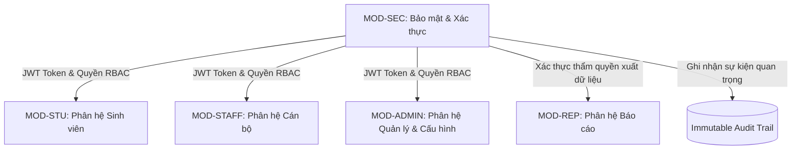

# PRD – MODULE E: PHÂN HỆ BẢO MẬT, XÁC THỰC & TRẢI NGHIỆM NGƯỜI DÙNG (SECURITY, AUTH & UX)

> **Dự án:** UniSupport – Hệ thống Quản lý Yêu cầu Hỗ trợ Sinh viên  
> **Khách hàng:** Aurora University  
> **Mã phân hệ:** MOD-SEC (Module E - Security, Authentication & User Experience)  
> **Phiên bản:** v1.0 | Ngày cập nhật: 03/10/2026  
> **Tài liệu cha:** [UNISUPPORT_PRD.md](file:///c:/Users/Admin/Documents/New%20Folder/UniSupport_Project/docs/prd/UNISUPPORT_PRD.md)  
> **Giai đoạn triển khai chính:** Phase P2 (Phân tích & UI), Phase P3 (Nền tảng & Xác thực) & Phase P7 (Security Review)

---

## 1. Tổng quan phân hệ

### 1.1. Mục tiêu
Đóng vai trò là nền tảng hạ tầng bảo mật, kiểm soát danh tính và định hình chuẩn mực trải nghiệm người dùng (UX) xuyên suốt toàn bộ hệ thống UniSupport của Aurora University. Phân hệ này chịu trách nhiệm:
1. Xác thực người dùng (Authentication), quản lý phiên làm việc tập trung (Session Timeout) và cơ chế chống tấn công dò mật khẩu (Brute-force protection).
2. Kiểm soát truy cập nghiêm ngặt dựa trên 04 vai trò (Role-Based Access Control - RBAC) tại cả tầng giao diện người dùng và tầng API Backend.
3. Bảo vệ an toàn tệp đính kèm, ngăn chặn rò rỉ dữ liệu qua đường dẫn công khai (No Public URL / Signed URL enforcement).
4. Duy trì nhật ký kiểm toán hệ thống không thể xóa sửa (Immutable System Audit Trail).
5. Thực thi nghiêm ngặt cam kết sử dụng 100% dữ liệu giả lập (Mock Data Seeding) trong môi trường phát triển, kiểm thử và UAT nghiệm thu.
6. Cung cấp trải nghiệm người dùng hiện đại: Hỗ trợ song ngữ Tiếng Việt & Tiếng Anh (i18n) và tương thích hoàn hảo trên các thiết bị di động (Fully Responsive Web Design).

### 1.2. Đối tượng sử dụng chính (Target Actors)
Toàn bộ các tác nhân tham gia vào hệ thống UniSupport:
* **Sinh viên Aurora University:** Trải nghiệm cổng dịch vụ mượt mà trên điện thoại, an toàn thông tin cá nhân.
* **Cán bộ xử lý (Staff):** Truy cập hàng đợi an toàn, bảo vệ ghi chú nội bộ.
* **Quản lý phòng ban (Manager):** Giám sát dữ liệu và phê duyệt trong phạm vi phân quyền.
* **Quản trị viên hệ thống (Admin):** Kiểm soát bảo mật, tra cứu Audit Trail và quản lý cấu hình người dùng.

---

## 2. Kiến trúc Bảo mật & Nguyên tắc thiết kế UX

### 2.1. Ma trận phân quyền 04 vai trò (RBAC Matrix)

| Chức năng / Quyền hạn | Sinh viên (Student) | Cán bộ (Staff) | Quản lý (Manager) | Quản trị viên (Admin) |
| :--- | :---: | :---: | :---: | :---: |
| Tạo & Theo dõi Ticket cá nhân | **Có** | Không | Không | Không |
| Tra cứu FAQ & Đánh giá CSAT | **Có** | Có (Xem) | Có (Xem) | Có (Xem) |
| Xem hàng đợi Ticket phòng ban | Không | **Có** (Phòng mình) | **Có** (Phòng mình) | **Có** (Toàn trường) |
| Nhận việc & Phản hồi sinh viên | Không | **Có** | **Có** | Có |
| Thêm/Xem Ghi chú nội bộ | **Bị chặn tuyệt đối** | **Có** | **Có** | **Có** |
| Theo dõi Workload phòng ban | Không | Không | **Có** (Phòng mình) | **Có** (Toàn trường) |
| Tái phân công Ticket hàng loạt | Không | Không | **Có** (Phòng mình) | **Có** (Toàn trường) |
| Cấu hình SLA, Quy tắc Routing | Không | Không | Không | **Toàn quyền** |
| Quản lý Người dùng & Gán vai trò | Không | Không | Không | **Toàn quyền** |
| Xem Dashboard & Báo cáo hiệu suất | Không | Không | **Có** (Phòng mình) | **Có** (Toàn trường) |
| Xuất dữ liệu báo cáo ra tệp CSV | Không | Không | **Có** | **Có** |
| Xem Nhật ký kiểm toán (Audit Trail) | Không | Không | Không | **Có** |

### 2.2. Nguyên tắc an toàn thông tin (Security Guarantees)
* **Zero Trust File Access:** Tuyệt đối không cho phép truy cập tệp tĩnh trực tiếp. Mọi tệp tài liệu đính kèm đều phải đi qua Gateway xác thực quyền sở hữu ticket hoặc sử dụng Private URL có chữ ký điện tử.
* **Privacy by Design:** Sinh viên A không bao giờ có thể đọc được Ticket của Sinh viên B qua bất kỳ kịch bản nào (kể cả can thiệp sửa ID trên URL hoặc request API).
* **Mock Data Compliance:** Không sử dụng bất kỳ thông tin thực tế nào của sinh viên/giảng viên Aurora University trong toàn bộ quá trình phát triển và kiểm thử.

---

## 3. Đặc tả chi tiết các yêu cầu chức năng (Functional Specifications)

#### FR-41: Xác thực tài khoản & Quản lý phiên làm việc (Authentication & Session Management)

* **User Story:** Là một Người dùng (Sinh viên, Cán bộ, Quản lý, Admin), tôi muốn đăng nhập an toàn bằng tài khoản hệ thống để truy cập đúng các tính năng theo quyền hạn của mình.
* **Đặc tả logic (Specifications):**
  * Đăng nhập cục bộ bằng Tên đăng nhập / Email và Mật khẩu.
  * Cơ chế bảo vệ Brute-force: Tự động khóa đăng nhập tạm thời **15 phút** nếu nhập sai mật khẩu liên tiếp **05 lần**.
  * Thời gian hết hạn phiên làm việc (Session Timeout): Tự động đăng xuất sau **08 giờ** liên tục không có thao tác.
  * Điều hướng sau đăng nhập dựa trên vai trò (Role-based Redirect):
    * Sinh viên $\rightarrow$ Cổng tiếp nhận và danh sách Ticket của sinh viên (`/student/tickets`).
    * Cán bộ $\rightarrow$ Hàng đợi Ticket của cán bộ (`/staff/queue`).
    * Quản lý / Admin $\rightarrow$ Màn hình Dashboard quản lý (`/admin/dashboard`).
* **Tiêu chí chấp nhận (Acceptance Criteria):**
  * **AC-41.1 (Đăng nhập đúng vai trò):** Đăng nhập thành công chuyển hướng đến đúng trang chủ tương ứng với vai trò của người dùng.
  * **AC-41.2 (Khóa tạm thời khi sai mật khẩu):** Nhập sai mật khẩu lần thứ 5 $\rightarrow$ hệ thống hiển thị cảnh báo khóa tài khoản 15 phút và từ chối các yêu cầu đăng nhập tiếp theo trong thời gian này.
  * **AC-41.3 (Hết hạn phiên làm việc):** Sau 8 giờ không có tương tác, thao tác tiếp theo của người dùng sẽ kích hoạt thông báo hết hạn phiên và chuyển hướng về màn hình Đăng nhập.

#### FR-42: Đặt lại mật khẩu an toàn (Password Reset)

* **User Story:** Là một Người dùng, tôi muốn tự đặt lại mật khẩu qua email khi bị quên để có thể tiếp tục sử dụng hệ thống một cách nhanh chóng và an toàn.
* **Đặc tả logic (Specifications):**
  * Người dùng nhập địa chỉ Email đã đăng ký để yêu cầu đặt lại mật khẩu.
  * Hệ thống gửi một email chứa mã Token/Link đặt lại mật khẩu có thời hạn sử dụng trong vòng **15 phút** và chỉ dùng được **01 lần duy nhất**.
  * Quy chuẩn mật khẩu mới: Tối thiểu 08 ký tự, bao gồm ít nhất chữ hoa, chữ thường và chữ số.
* **Tiêu chí chấp nhận (Acceptance Criteria):**
  * **AC-42.1 (Gửi link đặt lại mật khẩu):** Nhập email hợp lệ $\rightarrow$ hệ thống gửi email xác thực trong vòng $\le 60$ giây.
  * **AC-42.2 (Kiểm tra độ phức tạp mật khẩu):** Hệ thống chặn lưu và báo lỗi nếu mật khẩu mới không đạt độ dài tối thiểu 8 ký tự hoặc thiếu chữ hoa/chữ số.
  * **AC-42.3 (Token hết hạn):** Nhấp vào liên kết sau 15 phút $\rightarrow$ hệ thống thông báo "Liên kết đã hết hạn, vui lòng yêu cầu lại".

#### FR-43: Phân quyền truy cập theo 04 vai trò (Role-Based Access Control - RBAC)

* **User Story:** Là một Quản trị viên, tôi muốn hệ thống thực thi kiểm soát truy cập nghiêm ngặt theo 04 vai trò để bảo vệ tính toàn vẹn và bí mật của dữ liệu.
* **Đặc tả logic (Specifications):**
  * Hệ thống phân quyền chặt chẽ cho 04 vai trò:
    * *Sinh viên:* Tạo, theo dõi, trao đổi Ticket của chính mình; tra cứu FAQ; đánh giá CSAT.
    * *Cán bộ xử lý:* Xử lý Ticket thuộc phòng ban mình; cập nhật trạng thái/priority; ghi chú nội bộ; phản hồi sinh viên.
    * *Quản lý phòng ban:* Toàn quyền trong phạm vi phòng ban; theo dõi workload; tái phân công ticket; duyệt FAQ; xem báo cáo.
    * *Quản trị viên (Admin):* Toàn quyền cấu hình hệ thống, người dùng, phòng ban, danh mục, routing rules và báo cáo toàn trường.
  * Kiểm soát ở cả 2 tầng: Tầng Giao diện (Ẩn menu/nút không có quyền) và Tầng API (Trả về mã lỗi `HTTP 403 Forbidden` nếu gọi trái thẩm quyền).
* **Tiêu chí chấp nhận (Acceptance Criteria):**
  * **AC-43.1 (Chặn truy cập trái phép):** Sinh viên cố tình nhập URL trang quản trị của Cán bộ hoặc gọi API lấy Ticket người khác $\rightarrow$ hệ thống chặn ngay và trả về lỗi 403 Forbidden.
  * **AC-43.2 (Đồng bộ giao diện theo quyền):** Menu điều hướng chỉ hiển thị đúng các chức năng mà vai trò hiện tại được phép thao tác.

#### FR-44: Kiểm soát quyền truy cập dữ liệu & tệp đính kèm (File Access Security)

* **User Story:** Là một Người dùng, tôi muốn các tài liệu và tệp đính kèm trên Ticket được bảo mật, chỉ những người có trách nhiệm mới có thể truy cập và tải về.
* **Đặc tả logic (Specifications):**
  * Tệp đính kèm không được lưu trữ trong thư mục tĩnh có thể truy cập công khai (No Public URL).
  * Mọi yêu cầu tải tệp phải đi qua API kiểm tra phiên đăng nhập và quyền truy cập đối với Ticket tương ứng, hoặc thông qua Private Signed URL có thời gian sống ngắn (ví dụ: **05 phút**).
* **Tiêu chí chấp nhận (Acceptance Criteria):**
  * **AC-44.1 (Bảo vệ đường dẫn tệp):** Người dùng chưa đăng nhập hoặc không liên quan đến Ticket khi truy cập đường link tệp đính kèm sẽ nhận thông báo lỗi từ chối truy cập (401 Unauthorized hoặc 403 Forbidden).
  * **AC-44.2 (Tải tệp hợp lệ):** Chủ sở hữu Ticket hoặc cán bộ thụ lý phòng ban nhấp vào tệp tải về bình thường với tốc độ ổn định.

#### FR-45: Ghi nhận nhật ký kiểm toán hệ thống (System Audit Trail)

* **User Story:** Là một Quản trị viên, tôi muốn hệ thống tự động ghi nhận các thao tác quản trị và an ninh quan trọng để phục vụ kiểm tra bảo mật và giải quyết sự cố.
* **Đặc tả logic (Specifications):**
  * Hệ thống tự động ghi nhận vào Audit Log các sự kiện:
    * Đăng nhập thất bại liên tiếp nhiều lần.
    * Thay đổi vai trò hoặc thông tin tài khoản người dùng.
    * Thêm, sửa, tắt các Danh mục hoặc Phòng ban.
    * Cập nhật các quy tắc phân luồng (Routing Rules) và cấu hình SLA.
  * Thông tin bản ghi: Timestamp chính xác, User ID thực hiện, Địa chỉ IP, Tên hành động, Chi tiết dữ liệu trước và sau thay đổi.
  * Dữ liệu Audit Log là dữ liệu chỉ đọc (Read-only), không cho phép chỉnh sửa hoặc xóa bởi bất kỳ người dùng nào (kể cả Admin).
* **Tiêu chí chấp nhận (Acceptance Criteria):**
  * **AC-45.1 (Ghi vết kiểm toán chuẩn xác):** Mọi thao tác cấu hình hệ thống của Admin đều được ghi nhận ngay vào bảng Audit Log với đầy đủ thông tin IP và người thực hiện.
  * **AC-45.2 (Tìm kiếm và lọc Audit Log):** Admin có thể lọc Audit Log theo khoảng ngày, theo User ID hoặc theo loại hành động.

#### FR-46: Sử dụng dữ liệu giả lập trong môi trường phát triển & kiểm thử (Mock Data Enforcement)

* **User Story:** Là một Quản lý dự án, tôi muốn toàn bộ quá trình phát triển, kiểm thử và nghiệm thu chỉ sử dụng dữ liệu giả lập để đảm bảo tuyệt đối an toàn thông tin cá nhân của sinh viên.
* **Đặc tả logic (Specifications):**
  * Tuân thủ đúng Assumption của dự án: Toàn bộ dữ liệu tài khoản sinh viên, email, số điện thoại, MSSV và nội dung ticket trên các môi trường Development, Staging và UAT đều là Mock Data (dữ liệu được sinh ngẫu nhiên).
  * Bộ dữ liệu Seed / Mock Data chuẩn phục vụ kiểm thử và nghiệm thu tối thiểu gồm:
    * **500** tài khoản sinh viên giả lập.
    * **20** tài khoản cán bộ và quản lý thuộc 4 phòng ban.
    * **500** Ticket mẫu ở đầy đủ các trạng thái và danh mục khác nhau.
  * Tuyệt đối không import hoặc sao chép dữ liệu thật của Aurora University vào môi trường kiểm thử.
* **Tiêu chí chấp nhận (Acceptance Criteria):**
  * **AC-46.1 (Nghiệm thu trên Mock Data):** Buổi Demo nghiệm thu chức năng tổng thể với đại diện Aurora University chạy hoàn toàn trên bộ dữ liệu giả lập đã được chuẩn bị trước.
  * **AC-46.2 (Không tồn đọng dữ liệu thật):** Báo cáo nghiệm thu khẳng định 100% dữ liệu thử nghiệm là dữ liệu nhân tạo, không vi phạm chính sách bảo mật thông tin cá nhân.

#### FR-47: Giao diện hỗ trợ song ngữ Tiếng Việt & Tiếng Anh (i18n Support)

* **User Story:** Là một Người dùng, tôi muốn dễ dàng chuyển đổi giao diện giữa Tiếng Việt và Tiếng Anh để sử dụng hệ thống thuận tiện theo ngôn ngữ phù hợp.
* **Đặc tả logic (Specifications):**
  * Ngôn ngữ mặc định của hệ thống: **Tiếng Việt**.
  * Cung cấp nút chuyển đổi nhanh ngôn ngữ (VI / EN) tại vị trí cố định trên thanh điều hướng Header.
  * Tùy chọn ngôn ngữ của người dùng được lưu trữ vào LocalStorage/Cookie để giữ nguyên trạng thái cho các lần truy cập sau.
  * Hỗ trợ chuyển đổi 100% các nhãn nút bấm, tiêu đề menu, thông báo lỗi, trạng thái và email mẫu.
* **Tiêu chí chấp nhận (Acceptance Criteria):**
  * **AC-47.1 (Chuyển đổi tức thì):** Khi bấm nút chọn "EN", toàn bộ giao diện lập tức chuyển sang Tiếng Anh mà không cần tải lại toàn bộ trang web.
  * **AC-47.2 (Ghi nhớ tùy chọn):** Đóng trình duyệt và mở lại, hệ thống giữ nguyên ngôn ngữ người dùng đã lựa chọn lần trước đó.

#### FR-48: Giao diện thích ứng trên Desktop và Mobile Web (Responsive UI)

* **User Story:** Là một Sinh viên hoặc Cán bộ, tôi muốn sử dụng hệ thống một cách mượt mà trên điện thoại di động và máy tính bảng mà không bị vỡ giao diện hay khó thao tác.
* **Đặc tả logic (Specifications):**
  * Thiết kế giao diện tương thích hoàn hảo (Fully Responsive) theo các dải màn hình:
    * *Mobile:* Độ rộng màn hình $< 768px$.
    * *Tablet:* Độ rộng màn hình từ $768px$ đến $1023px$.
    * *Desktop:* Độ rộng màn hình $\ge 1024px$.
  * Trên màn hình di động: Thanh điều hướng chuyển thành menu trượt (Drawer / Hamburger), bảng dữ liệu tự động chuyển thành dạng thẻ (Card view), các nút bấm đạt kích thước tối thiểu **$44 \times 44px$** để bấm dễ dàng bằng ngón tay.
* **Tiêu chí chấp nhận (Acceptance Criteria):**
  * **AC-48.1 (Thao tác di động hoàn chỉnh):** Sinh viên có thể hoàn thành toàn bộ luồng tạo Ticket, tra cứu FAQ, đính kèm ảnh chụp từ điện thoại và gửi tin nhắn trao đổi trên các trình duyệt di động (iOS Safari, Android Chrome) mà không gặp lỗi hiển thị hay tràn khung hình.
  * **AC-48.2 (Tương thích giao diện Responsive):** Không xuất hiện thanh cuộn ngang (horizontal scrollbar) ngoài ý muốn trên bất kỳ thiết bị di động nào có độ phân giải từ 360px trở lên.

---

## 4. Yêu cầu phi chức năng phân hệ (Module NFR)

* **Mã hóa và Bảo mật mạng:**
  * Bắt buộc sử dụng giao thức truyền thông an toàn HTTPS/TLS 1.3 cho toàn bộ kết nối.
  * Mật khẩu người dùng bắt buộc được mã hóa một chiều bằng thuật toán `bcrypt` với Salt factor tối thiểu 10 hoặc `Argon2id` trước khi lưu vào cơ sở dữ liệu.
* **Bảo vệ chống tấn công phổ biến (OWASP Top 10):**
  * Chống tấn công XSS (Cross-Site Scripting) bằng cách khử trùng mọi đầu vào nội dung tin nhắn và FAQ.
  * Chống CSRF (Cross-Site Request Forgery) bằng Token đồng bộ.
  * Rate-limiting API đăng nhập: Giới hạn tối đa 10 request/phút trên mỗi IP để ngăn ngừa tấn công từ chối dịch vụ DoS/Brute-force.
* **Khả năng tiếp cận & Trải nghiệm (Accessibility - a11y):**
  * Tuân thủ tiêu chuẩn tương phản màu sắc WCAG 2.1 AA (Tỷ lệ tương phản văn bản tối thiểu 4.5:1).
  * Hỗ trợ điều hướng bằng bàn phím (Tab, Enter, Escape) cho các Modal và Form nhập liệu.

---

## 5. Mối liên hệ & Tích hợp với các phân hệ khác

* **Xuyên suốt toàn hệ thống:** Module E là lớp nền tảng bảo vệ và cung cấp ngữ cảnh người dùng (Identity Context) cho tất cả các Module A, B, C, D. Mọi request muốn thao tác trên các phân hệ khác đều phải có sự xác nhận tính hợp lệ từ Module E.
